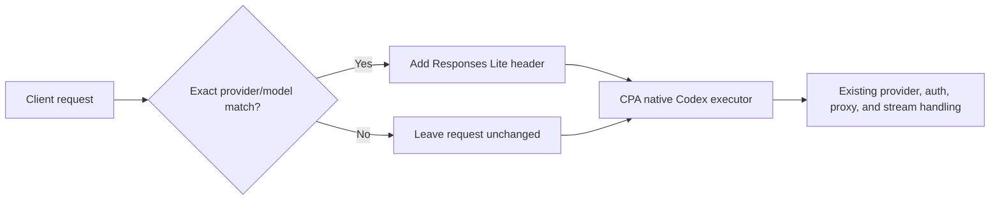

# Codex Responses Lite Rules for CPA

[](https://github.com/AstroQore/cpa-plugin-codex-responses-lite/actions/workflows/ci.yml)
[](https://github.com/AstroQore/cpa-plugin-codex-responses-lite/releases)
[](LICENSE)

A small [CLIProxyAPI](https://github.com/router-for-me/CLIProxyAPI) request-interceptor plugin that enables CPA's native **Codex Responses Lite** path for selected provider-prefix/model pairs.

[简体中文](README.zh-CN.md)

## Why this plugin exists

CPA's Codex executor can automatically add the hosted `image_generation` tool. Some OpenAI-compatible upstream models support the Responses API but do not support that hosted tool. CPA already has a Responses Lite path that skips the automatic injection; this plugin selects that existing path with a narrowly scoped rule.


```mermaid
flowchart LR
    A[Client request] --> B{Exact provider/model match?}
    B -- No --> C[Leave request unchanged]
    B -- Yes --> D[Add Responses Lite header]
    D --> E[CPA native Codex executor]
    C --> E
    E --> F[Existing provider, auth, proxy, and stream handling]
```

The plugin adds one internal request header when a rule matches:

```http
X-OpenAI-Internal-Codex-Responses-Lite: true
```

Everything after that remains native CPA behavior.

## Features

- Exact, case-sensitive matching on `provider_prefix/model`.
- Multiple provider prefixes and model allowlists.
- Applies both before and after credential selection.
- No network client, credentials, upstream URL, proxy, retry loop, stream parser, or usage accounting.
- No request-body rewriting.
- Loaded without rules stays inactive (matches nothing) instead of failing; non-empty rules fail fast for missing, duplicate, or ambiguous entries.

## Requirements

- CLIProxyAPI with dynamic plugin support. The initial release is tested with CPA `v7.2.127`.
- A target model already configured on CPA's native Codex/Responses-capable path, normally under `codex-api-key`.
- Provider prefixes enabled in CPA so clients can request `prefix/model`.
- Prebuilt Linux amd64 and Linux arm64 artifacts. Other platforms can build from source.

This plugin does **not** register models or move models between provider sections. Configure models and credentials in CPA first, then use this plugin only to select Responses Lite for the desired prefixed model names.

## Installation

1. Download the release asset for your platform and verify it against `checksums.txt`.
2. Put the dynamic library in CPA's plugin directory. The filename must remain `aq-codex-responses-lite.so` on Linux, `.dylib` on macOS, or `.dll` on Windows.
3. Add the plugin configuration to CPA's `config.yaml`.
4. Restart or reload CPA according to your deployment process, then verify registration in the CPA logs or plugin management API.

Example for Linux amd64:

```bash
unzip aq-codex-responses-lite_<version>_linux_amd64.zip
install -m 0755 aq-codex-responses-lite.so /path/to/cpa/plugins/
```

Example for Linux arm64 (for example Raspberry Pi 64-bit, ARM servers, Apple Silicon VMs):

```bash
unzip aq-codex-responses-lite_<version>_linux_arm64.zip
install -m 0755 aq-codex-responses-lite.so /path/to/cpa/plugins/
```

## Install from the CPA Plugin Store

[`registry.json`](registry.json) at the repository root is a manifest the CPA custom
plugin store can read directly: schema v2 with `direct` artifacts, pinning each
release zip URL and its SHA-256. CPA downloads the zip and verifies the digest
without calling the GitHub Releases API, so anonymous API rate limits do not apply.

Point CPA at this store source in `config.yaml`:

```yaml
plugins:
  enabled: true
  dir: "/CLIProxyAPI/plugins"
  store-sources:
    - "https://raw.githubusercontent.com/lzy-xkwh/cpa-plugin-codex-responses-lite/main/registry.json"
```

Restart CPA, open **admin → Plugin Store**, refresh, then install or update
`aq-codex-responses-lite`. CPA writes a `store` metadata block into the plugin
configuration afterwards; the plugin ignores it.

Notes:

- The store source points at `registry.json` on `main`. After every version tag the
  release workflow updates that file, so later upgrades are a click in the store
  instead of copying a dynamic library again.
- The `direct` install type never touches `api.github.com`; only add `store-auth`
  if you also mount a store source that resolves assets through the GitHub API.
- If the server cannot reach `raw.githubusercontent.com` reliably, use the jsDelivr
  mirror `https://cdn.jsdelivr.net/gh/lzy-xkwh/cpa-plugin-codex-responses-lite@main/registry.json`
  (it caches for hours, so a fresh release may take a while to appear). The mirror
  only serves the manifest; the zip still comes from GitHub.
- If downloads keep failing, install manually: unzip the release asset for your
  architecture, drop `aq-codex-responses-lite.so` into the plugin directory, restart.

### Troubleshooting store installs

`POST /v0/management/plugin-store/:id/install` answers 502 with a machine-readable
`error` field:

| error | Meaning | What to do |
| --- | --- | --- |
| `plugin_store_registry_failed` | CPA could not fetch `registry.json` | Check connectivity to `raw.githubusercontent.com`, or switch to the jsDelivr mirror |
| `plugin_manifest_invalid` | The manifest failed validation | Keep the full message and open an issue; run `make check-registry` locally to locate it |
| `plugin_install_failed` | Zip download, SHA-256 check, or extraction failed | Retry once; if it persists check `objects.githubusercontent.com`, or install manually |

## Configuration

After installing, open **CPA admin → Plugins → aq-codex-responses-lite → Responses Lite** for a visual rules editor (the wizard asks for the management key and saves through the management API). Alternatively, edit CPA's `config.yaml`:

```yaml
plugins:
  enabled: true
  dir: /path/to/cpa/plugins
  configs:
    aq-codex-responses-lite:
      enabled: true
      priority: 200
      rules:
        - provider_prefix: opencode
          models:
            - grok-4.5
            - muse-spark-1.2-contributor
        - provider_prefix: another-provider
          models:
            - another-model
```

See [examples/config.yaml](examples/config.yaml) for a copy-ready example.

### Matching behavior

| Requested model | Example rule | Result |
| --- | --- | --- |
| `opencode/grok-4.5` | prefix `opencode`, model `grok-4.5` | Responses Lite enabled |
| `grok-4.5` | same rule | Unchanged; bare names never match |
| `opencode/other-model` | same rule | Unchanged |
| `OpenCode/grok-4.5` | same rule | Unchanged; matching is case-sensitive |
| `other/grok-4.5` | same rule | Unchanged |

## Important behavior and limits

- Responses Lite also makes CPA set `parallel_tool_calls=false`. Test function calling as well as plain text for every newly enabled model.
- The plugin prevents CPA's **automatic** hosted `image_generation` injection for matching requests. It does not remove tools explicitly supplied by a client.
- It does not guarantee that an upstream model supports every other Responses API feature.
- It does not alter Chat Completions traffic or non-matching model requests.
- A configuration reload with invalid plugin rules is rejected instead of silently broadening the match.

## Build and test

Go `1.26` and a C toolchain are required because CPA plugins use Go's `c-shared` build mode.

```bash
make check
make build
```

The library is written to `dist/`. On a Linux amd64 host, maintainers can create the store-compatible amd64 release files with:

```bash
make package VERSION=0.3.0
```

To package for Linux arm64, install the cross toolchain (`gcc-aarch64-linux-gnu` on Debian/Ubuntu) and set the target architecture:

```bash
make package VERSION=0.3.0 TARGET_ARCH=arm64
```

The release zip contains exactly one root-level dynamic library, as required by the CPA Plugin Store.

### Maintaining the store manifest

After a version tag is pushed, the release workflow points `registry.json` at the new
release and commits it back to `main`. To do the same locally, or to redo it after a
failed workflow run:

```bash
make registry VERSION=0.3.0                        # digests from that release's checksums.txt
make registry VERSION=0.3.0 ARTIFACTS_DIR=dist     # or compute digests from local zips
make check-registry                                # validate registry.json
```

`registry.json` always points at the newest *published* release, so the file inside a
given tag may still reference the previous version: CPA reads the manifest from
`main`, never from a tag. The field rules live in
[`scripts/check-registry.py`](scripts/check-registry.py).

## Troubleshooting

**The plugin loads but does not match**

Use the exact client-visible prefixed model name. Bare model names are intentionally ignored. Prefix and model matching are case-sensitive.

**The request still contains `image_generation`**

Check whether the tool was supplied by the client. This plugin only disables CPA's automatic hosted-tool injection. Also confirm that CPA registered the plugin as a request interceptor and loaded the expected rule.

**Tool calls behave differently**

Responses Lite disables parallel tool calls in CPA. Prefer `tool_choice=auto` unless the upstream explicitly supports stricter modes, and validate the upstream model directly.

## Security

Plugin configuration contains only provider prefixes and model identifiers. Do not put API keys or upstream credentials in it. See [SECURITY.md](SECURITY.md) for vulnerability reporting.

## Contributing

Issues and focused pull requests are welcome. Please read [CONTRIBUTING.md](CONTRIBUTING.md) before submitting changes.

## License

[MIT](LICENSE) © AstroQore.
