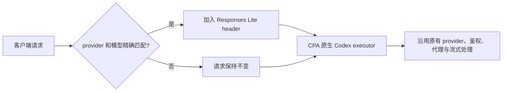

# CPA Codex Responses Lite 规则插件

[](https://github.com/AstroQore/cpa-plugin-codex-responses-lite/actions/workflows/ci.yml)
[](https://github.com/AstroQore/cpa-plugin-codex-responses-lite/releases)
[](LICENSE)

这是一个小型 [CLIProxyAPI](https://github.com/router-for-me/CLIProxyAPI) 请求拦截器。它按指定的 provider 前缀和模型，选择性启用 CPA 已有的 **Codex Responses Lite** 链路。

[English](README.md)

## 为什么需要它

CPA 的 Codex executor 可能自动加入托管的 `image_generation` 工具。一些兼容 OpenAI Responses API 的上游模型并不支持这个托管工具。CPA 本身已经提供 Responses Lite 链路，可以跳过自动注入；本插件只负责用精确规则选择这条现成链路。


```mermaid
flowchart LR
    A[客户端请求] --> B{provider 和模型精确匹配?}
    B -- 否 --> C[请求保持不变]
    B -- 是 --> D[加入 Responses Lite header]
    D --> E[CPA 原生 Codex executor]
    C --> E
    E --> F[沿用原有 provider、鉴权、代理与流式处理]
```

规则匹配时，插件只加入一个内部请求头：

```http
X-OpenAI-Internal-Codex-Responses-Lite: true
```

之后的路由、鉴权、请求转换、上游调用、流式解析和用量统计全部继续由 CPA 原生实现负责。

## 特性

- 对 `provider_prefix/model` 做精确、区分大小写的匹配。
- 支持多个 provider 前缀及各自的模型白名单。
- 在选取凭据前后两个请求拦截阶段都生效。
- 不维护 HTTP client、凭据、上游地址、代理、重试、流解析或用量统计。
- 不改写请求正文。
- 未配置规则时插件正常加载但不匹配任何请求（而不是启动报错）；非空规则仍会对缺失、重复或歧义条目直接报错。

## 使用前提

- CLIProxyAPI 已支持动态插件；首个版本在 CPA `v7.2.127` 上验证。
- 目标模型已经配置在 CPA 原生、支持 Codex/Responses 的链路上，通常位于 `codex-api-key` 配置下。
- CPA 已开启 provider 前缀，客户端会请求 `prefix/model`。
- 提供 Linux amd64 和 Linux arm64 预编译包；其他平台可自行从源码构建。

本插件**不会**注册模型，也不会把模型从一个 provider 配置搬到另一个 provider 配置。请先在 CPA 中配置好模型和凭据，再用本插件为指定的带前缀模型启用 Responses Lite。

## 安装

1. 下载对应平台的 Release 压缩包，并用 `checksums.txt` 校验。
2. 将动态库放进 CPA 插件目录。Linux 文件名必须是 `aq-codex-responses-lite.so`；macOS 为 `.dylib`，Windows 为 `.dll`。
3. 在 CPA `config.yaml` 中加入插件配置。
4. 按你的部署流程重启或重新加载 CPA，并从日志或插件管理 API 确认注册成功。

Linux amd64 示例：

```bash
unzip aq-codex-responses-lite_<version>_linux_amd64.zip
install -m 0755 aq-codex-responses-lite.so /path/to/cpa/plugins/
```

Linux arm64 示例（如 64 位树莓派、ARM 服务器、Apple Silicon 虚拟机）：

```bash
unzip aq-codex-responses-lite_<version>_linux_arm64.zip
install -m 0755 aq-codex-responses-lite.so /path/to/cpa/plugins/
```

## 从 CPA 插件商店安装

仓库根目录的 [`registry.json`](registry.json) 是可直接被 CPA 自定义插件商店读取的
清单：schema v2、`direct` 安装方式，写死了 release zip 的下载地址与 SHA-256。
CPA 只下载 zip 并校验摘要，不调用 GitHub Releases API，因此不受匿名 API
速率限制影响。

在 CPA 的 `config.yaml` 里挂上这个商店源：

```yaml
plugins:
  enabled: true
  dir: "/CLIProxyAPI/plugins"
  store-sources:
    - "https://raw.githubusercontent.com/lzy-xkwh/cpa-plugin-codex-responses-lite/main/registry.json"
```

重启 CPA，进入 **管理后台 → 插件商店**，刷新后安装或更新
`aq-codex-responses-lite`。安装完成后 CPA 会把 `store` 元数据写进该插件的配置，
插件会忽略它。

要点：

- 商店源指向 `main` 分支的 `registry.json`，每次发布新 tag 后 release 工作流会
  自动把它更新到最新版本，所以后续升级只需在商店里点更新，不必再手工替换动态库。
- 清单里的 `direct` 方式不访问 `api.github.com`；如果你还挂了别的走 GitHub API
  的商店源，再按需为它配置 `store-auth` 令牌。
- 如果服务器到 `raw.githubusercontent.com` 不稳定，可换 jsDelivr 镜像：
  `https://cdn.jsdelivr.net/gh/lzy-xkwh/cpa-plugin-codex-responses-lite@main/registry.json`
  （有数小时缓存，新版本可能延迟可见）。镜像只加速清单，zip 仍从 GitHub 下载。
- 下载一直失败时可回退手动安装：从 Releases 下载对应架构 zip，解压出
  `aq-codex-responses-lite.so` 放进插件目录后重启。

### 商店安装/更新失败排查

`POST /v0/management/plugin-store/:id/install` 返回 502 时，响应 body 的 `error`
字段可区分原因：

| error | 含义 | 处理 |
| --- | --- | --- |
| `plugin_store_registry_failed` | CPA 拉取 `registry.json` 失败 | 检查服务器到 `raw.githubusercontent.com` 的连通性，或换 jsDelivr 镜像 |
| `plugin_manifest_invalid` | 清单校验失败 | 保留完整 message 反馈到仓库 issue；本地可跑 `make check-registry` 定位 |
| `plugin_install_failed` | 下载 zip、校验 SHA-256 或解压失败 | 重试一次；反复失败时检查到 `objects.githubusercontent.com` 的连通性，或改为手动安装 |

## 配置

安装后可在 **CPA 管理后台 → 插件 → aq-codex-responses-lite → Responses Lite** 打开可视化规则编辑页（向导会要求输入管理密钥，通过管理 API 保存）。也可以直接手改 CPA 的 `config.yaml`：

```yaml
plugins:
  enabled: true
  dir: /path/to/cpa/plugins
  configs:
    aq-codex-responses-lite:
      enabled: true
      priority: 200
      rules:
        - provider_prefix: opencode
          models:
            - grok-4.5
            - muse-spark-1.2-contributor
        - provider_prefix: another-provider
          models:
            - another-model
```

可直接复制的版本见 [examples/config.yaml](examples/config.yaml)。

### 匹配规则

| 请求模型 | 示例规则 | 结果 |
| --- | --- | --- |
| `opencode/grok-4.5` | prefix 为 `opencode`，model 为 `grok-4.5` | 启用 Responses Lite |
| `grok-4.5` | 同上 | 不修改；裸模型名不会匹配 |
| `opencode/other-model` | 同上 | 不修改 |
| `OpenCode/grok-4.5` | 同上 | 不修改；大小写敏感 |
| `other/grok-4.5` | 同上 | 不修改 |

## 重要行为与边界

- Responses Lite 会同时让 CPA 设置 `parallel_tool_calls=false`。每次新增模型都应同时验证纯文本和工具调用。
- 插件阻止的是 CPA **自动注入**托管 `image_generation` 工具；不会删除客户端主动传入的工具。
- 它不保证上游模型支持 Responses API 的其他全部能力。
- 它不会改变 Chat Completions 请求，也不会影响任何未匹配模型。
- 配置热加载时，如果插件规则无效，会拒绝配置，而不是静默扩大匹配范围。

## 构建与测试

由于 CPA 插件使用 Go `c-shared` 构建模式，需要 Go `1.26` 和 C 工具链。

```bash
make check
make build
```

动态库会输出到 `dist/`。维护者可在 Linux amd64 主机上生成符合官方插件商店规范的 amd64 发布文件：

```bash
make package VERSION=0.3.0
```

如需打包 Linux arm64 版本，先安装交叉工具链（Debian/Ubuntu 为 `gcc-aarch64-linux-gnu`），再指定目标架构：

```bash
make package VERSION=0.3.0 TARGET_ARCH=arm64
```

发布 zip 的根目录只包含一个动态库文件，满足 CPA Plugin Store 的要求。

### 维护商店清单

发布新 tag 后，release 工作流会自动把 `registry.json` 指到新版本并提交回 `main`。
需要在本地复核或补做时：

```bash
make registry VERSION=0.3.0                        # 读取该 release 的 checksums.txt
make registry VERSION=0.3.0 ARTIFACTS_DIR=dist     # 或用本地 dist/ 里的 zip 计算摘要
make check-registry                                # 校验 registry.json 结构
```

`registry.json` 始终指向**已发布的最新版本**，所以某个 tag 自带的清单可能仍指向上一个
版本：CPA 只从 `main` 读取该文件，不读 tag。清单字段含义见
[`scripts/check-registry.py`](scripts/check-registry.py)。

## 排障

**插件已加载但没有匹配**

请使用客户端实际看到的完整带前缀模型名。裸模型名不会匹配，前缀和模型名均区分大小写。

**请求中仍然出现 `image_generation`**

先确认这个工具是否由客户端主动传入；本插件只关闭 CPA 的自动注入。再确认 CPA 已将插件注册为 request interceptor，并加载了预期规则。

**工具调用表现不同**

Responses Lite 会关闭 CPA 的并行工具调用。除非上游明确支持更严格模式，建议先使用 `tool_choice=auto`，并对具体模型做真实请求验证。

## 安全

插件配置只应包含 provider 前缀和模型 ID，不要写入 API key 或上游凭据。漏洞报告方式见 [SECURITY.md](SECURITY.md)。

## 参与贡献

欢迎提交聚焦的问题和 PR。提交修改前请阅读 [CONTRIBUTING.md](CONTRIBUTING.md)。

## 许可证

[MIT](LICENSE) © AstroQore。
